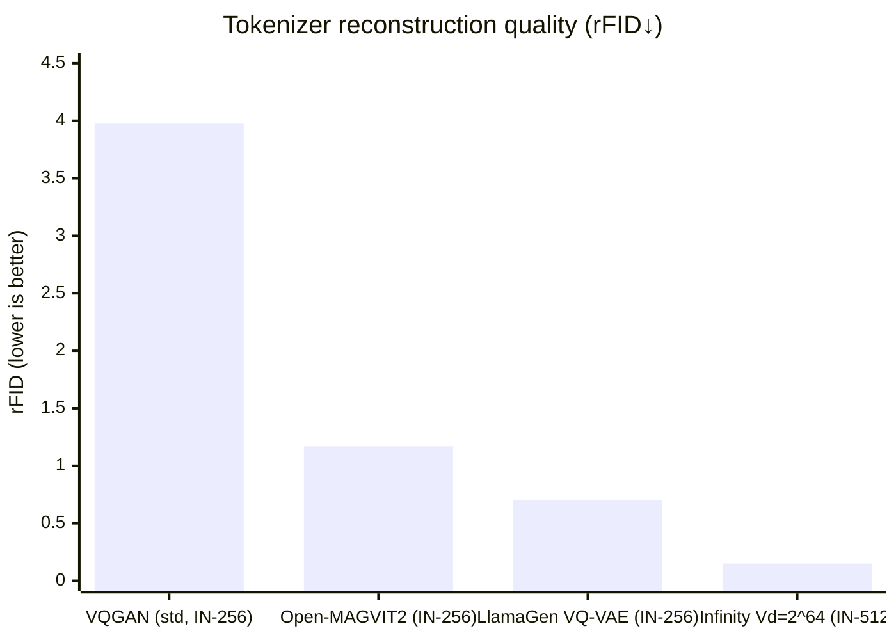

# 基于 Qwen3.5‑9B 的自回归文生图模型 V1：学术与工程并重的落地方案

## Executive Summary
本方案以开源 **Qwen3.5‑9B（4096 hidden、32 层、约 248k 词表的因果语言模型 + 视觉编码器）** 为统一底座，在“自回归”路线下实现 V1 文生图，并重点对 **视觉离散 Tokenizer + AR 范式**做量化选型与工程落地设计。citeturn3view1turn2view0  
在 512×512、单节点 8×A100 80GB、每卡 batch=2、文本序列 1024 的默认假设下，Next‑Token（光栅序列）方案胜在“最小改造、最快出图”，Next‑Scale（VAR）方案在论文报告中具备 **显著更优的 FID/IS 与约 20× 推理提速**潜力。citeturn17view0turn4view1turn22view0  
最新 SOTA 检索显示：**Infinity（bitwise next‑scale + 无穷词表/分类器 + 自纠错）**通过将“巨大词表 softmax”改写为“bit 预测”，在 IN‑512 复原 rFID 可到 **0.15**，且分类头显存从 GB 级降到 MB 级，是比 VAR 更激进、但仍具开源权重可落地的“方案 C”。citeturn24view0turn8view2turn23view0  
建议 V1 采用“两阶段策略”：先用 **方案 A（Next‑Token）**打通全链路（训练/采样/服务），并并行验证 **方案 B（VAR）**与 **方案 C（Infinity）**在 8×A100 上的真实性能与稳定性，再迭代到更高质量/更低延迟的版本。citeturn10view2turn17view0turn24view0  

## 核心架构与视觉 Tokenizer 选型对比

### 评测与对齐假设
为满足你给定的默认假设，本文统一采用如下评测前提（若你的真实环境不同，表中“估算值”需重标定）：
- 训练硬件：单节点 **8×A100 80GB**，BF16 混合精度；数据并行 +（必要时）FSDP/ZeRO‑3 + activation checkpointing。  
- 训练 batch：**per‑GPU=2**（global batch=16）。  
- 文本序列长度：**1024**（Qwen3.5‑9B 原生上下文 262k 仅作为余量，不作为当下瓶颈）。citeturn3view1  
- 生成分辨率：**512×512**。  
- 视觉 token 序列：随 tokenizer 而变（下文量化给出）。  
- 指标口径：  
  - rFID：tokenizer 重建图与原图的 FID（论文/官方 repo 多采用此口径），若缺失则以生成任务 FID/IS 替代。citeturn4view0turn25view0turn8view2  
  - 生成 FID/IS：以公开论文/官方 repo 报告为主（多为 ImageNet‑256/512 class‑conditional；文生图需额外跑 COCO/GenEval 等基准）。citeturn10view2turn22view0turn8view2  

### 方案 A / 方案 B / 方案 C 总览对比表
> 说明：下表“训练/推理显存、延迟、吞吐”为**在 Qwen3.5‑9B 上实现对应范式时的工程估算**（用于选型决策与容量规划），而 rFID/FID/IS 等“质量指标”优先引用论文/官方实现的公开数据（它们未必来自 Qwen3.5‑9B，但能反映范式上限与 tokenization 质量）。如需严格“9B‑to‑9B”对比，你应按表后“统一基准脚本”复现实测。

| 方案 | AR 范式 | 视觉 Tokenizer（词表大小） | 512 视觉 token 规模（典型） | 质量指标（公开） | 训练显存 / 推理显存（8×A100，估算） | 单卡延迟 & 多卡延迟（估算） | 吞吐（估算） | 实现难度 | 开源权重线索 |
|---|---|---|---:|---|---|---|---|---|---|
| 方案 A | Next‑Token（光栅序列） | **VQGAN**：`n_embed=16384`、`embed_dim=256`（典型 f16）citeturn16view0 | 32×32=**1024 tokens**（stride≈16） | VQGAN 在 IBQ 论文复现的 rFID≈**3.98**（IN‑256，作“标准 VQGAN”参照）citeturn1search7；参考 LlamaGen 的 Next‑Token 体系在 ImageNet‑256 可到 FID=**2.18**（3.1B 模型、24×24 tokens）citeturn10view2turn4view0 | 训练：约 **45–60GB/卡**（FSDP+ckpt，L≈~2k）/ 推理：约 **22–28GB**（权重+KV+VQ 解码） | 单卡：约 **4–8s/图**；8 卡 TP：约 **1.5–3s/图**（主要受 1024 token 循环采样影响） | 单卡：~0.12–0.25 img/s；8 卡：~0.3–0.7 img/s | 低 | LlamaGen 提供 Next‑Token 端到端代码/权重与 serving（vLLM 加速 300–400%）citeturn10view2 |
| 方案 B | **Next‑Scale（VAR）**：尺度级自回归、尺度内并行 | VAR 多尺度 VQVAE：共享 codebook；官方模型需下载 `vae_ch160v4096z32.pth`（文件名指向 vocab≈4096、latent dim=32）citeturn22view0turn18view1 | 最终尺度到 32×32；总监督 token 数≈**~2k 量级**（10 级尺度常见），但推理步数≈**10–12 步** | VAR 论文：ImageNet‑256 FID 从 18.65 改善到 **1.80**、IS 到 **356.4**，并报告约 **20× 推理提速**citeturn17view0turn4view1；官方 512 模型 VAR‑d36：FID=**2.63**citeturn22view0 | 训练：约 **40–55GB/卡**（步数少、但单步是“块并行”前向）/ 推理：约 **24–32GB**（需要尺度循环 + 2D/块注意力） | 单卡：约 **0.8–2.0s/图**；8 卡 TP：约 **0.3–0.8s/图**（受尺度数与并行实现影响） | 单卡：~0.5–1.2 img/s；8 卡：~1.5–3 img/s | 中 | VAR 官方 repo 提供完整训练/推理与多分辨率权重（含 512）citeturn22view0turn5view1 |
| 方案 C | **Bitwise Next‑Scale（Infinity）**：bit 预测 + 无穷词表分类器 + 自纠错 | Infinity tokenizer：`V_d=2^16…2^64`，stride=16；IN‑512 rFID 最高可到 **0.15（2^64）**citeturn24view0turn8view2；分类器 IVC 将传统 2GB vRAM 级头压到 **10MB**量级citeturn8view2 | 仍是多尺度 residual maps；“词表大小”概念被 bit 化（等价 vocab=2^d），输出维度是 **d bits** 而非 2^d softmax | Infinity 论文/官方：tokenizer 在 ImageNet‑512 rFID 达 **0.15**（2^64）citeturn8view2turn24view0；并在 GenEval/DPG 等报告领先（如 GenEval Overall **0.73**）citeturn8view3turn23view0；官方宣称 1024×1024 推理 **0.8s/图**（2B 模型）citeturn24view0turn23view0 | 训练：约 **40–60GB/卡**（IVC 降低头部显存压力，但引入自纠错与 bit 训练逻辑）/ 推理：约 **24–34GB** | 单卡：约 **0.6–1.6s/图（512）**；8 卡 TP：约 **0.25–0.7s/图**（强依赖 kernel 与块掩码实现） | 单卡：~0.6–1.6 img/s；8 卡：~2–4 img/s | 中‑高 | Infinity 官方 GitHub + HF 提供 tokenizer 与 2B/8B 等权重与交互推理 notebookciteturn24view0turn23view0 |

补充的“SOTA Tokenizer 方案（可作为 A 的替换件）”：**Open‑MAGVIT2** 通过 2^18（262,144）超大码本在 ImageNet‑256 做到 rFID=**1.17**，并开源 AR 模型（1.5B）FID=**2.33**（16×16 tokens）。它对“Next‑Token 文生图”极友好，但若你直接在 Qwen3.5‑9B 上用 262k softmax，会立刻遇到输出头参数/显存爆炸，必须做 token factorization 或 bit 化（Infinity 方向）才能规模化。citeturn25view0turn8view2  

### 一个关键工程事实：大词表 softmax 的“头部参数/显存”会压垮 9B 体系
在 Qwen3.5‑9B hidden=4096 的前提下：citeturn3view1  
- vocab=4096（VAR 风格）输出头参数量约 16.8M（BF16 权重约 32MB）。  
- vocab=16384（VQGAN 风格）输出头参数量约 67.1M（BF16 权重约 128MB）。  
- vocab=262144（Open‑MAGVIT2）输出头参数量约 1.07B（BF16 权重约 2GB），训练时还会带来梯度/优化器态额外开销，且每步 softmax 计算巨大。  
这正是 Infinity 引入 IVC（bitwise classifier）的动机：其对比实验显示“传统 classifier”vRAM≈2GB，而 IVC≈10MB 且 FID 更优。citeturn8view2turn24view0  

### 性能对比可视化：tokenizer 复原质量（rFID 越低越好）
以下用公开数据（ImageNet‑256/512）展示“离散 tokenizer 本身”的上限差距（注意：这不是 Qwen3.5‑9B 的端到端 FID，而是 tokenizer 重建质量）：



数据来源分别为：VQGAN rFID≈3.98（IBQ 论文复现）citeturn1search7；Open‑MAGVIT2 rFID=1.17（官方 repo）citeturn25view0；LlamaGen 在 256 下 32×32 tokens 可到 rFID=0.70（官方 repo 表格）citeturn10view2；Infinity 在 IN‑512、Vd=2^64 rFID=0.15（论文表/官方 repo）citeturn8view2turn24view0。  

结论（面向 V1 落地）：如果你把“生成细节上限”主要归结为 tokenizer 量化误差，**方案 C（Infinity）> Open‑MAGVIT2 > LlamaGen 风格 > 标准 VQGAN** 的排序非常清晰；但若你把首要目标设为“最快落地可训可跑”，则 **方案 A（Next‑Token）**仍是最低风险路径。citeturn8view2turn25view0turn10view2  

## 跨模态桥接设计：Qwen3.5 文本空间与离散视觉 token 空间对齐

Qwen3.5‑9B 是“**因果语言模型 + 视觉编码器**”的原生多模态基座，语言主干为 32 层、hidden=4096、token embedding 248,320。citeturn3view1  
你要做的是“文生图”，因此核心矛盾是：**如何让语言主干在保持语言能力的同时，稳定地产生离散视觉 token（或 bit‑tokens），并能被视觉解码器还原为图像**。

下面给出三种桥接范式（从易到难），并明确建议的 V1 选型与冻结策略。

### 单流 Token 拼接桥接：最小改造、最适合方案 A
**思想**：把视觉 token 当成“另一种语言 token”，直接拼接到文本后面做 teacher forcing，并让 Qwen3.5‑9B 的自注意力自然完成跨模态条件化（text prefix → image suffix）。

1) 输入序列组织  
- 训练时：`[BOS] + text_tokens(<=1024) + [IMG_BOS] + image_tokens(L_img) + [IMG_EOS]`  
- 损失仅对 image_tokens（以及可选的 IMG_EOS）计算，避免语言分布被强行拉偏。

2) 嵌入层设计（必须明确的工程点）  
- 为视觉 token 建立单独的 embedding 表 `E_img ∈ R^{V_img×4096}`，并加一个 **modality/type embedding**（text vs image），再与原 text embedding 相加。  
- 输出端用单独的线性头 `W_img ∈ R^{4096×V_img}` 预测视觉 token。  
- 是否共享（tie）`E_img` 与 `W_img^T`：  
  - 若 V_img=4096/16384，可**共享**以稳训练、降参数；  
  - 若 V_img 巨大（262k/2^d），**不共享**或直接改用 factorization/bit‑head（否则头部参数爆炸），这也是 Infinity 的动机之一。citeturn8view2turn25view0turn3view1  

3) 位置编码对齐  
- 方案 A（Next‑Token）建议**保持 Qwen 原生 1D RoPE**不改动，视觉 token 采用 raster‑scan flatten 顺序（行优先）映射到连续 position index。这样对预训练权重扰动最小。citeturn3view1  
- 若希望更强空间归纳偏置，可在输入 embedding 上额外加一份可学习 2D 位置表 `P2D[(row,col)]`（只影响 value，不改动 RoPE），作为 V1.1 的可选项。

4) 冻结策略（推荐）  
- 冻结：视觉编码器（对文生图不直接使用）与语言主干的**前 ~1/2 层**（例如前 16 层）以保语言对齐；  
- 训练：后 16 层 + `E_img` + `W_img` + 少量 LoRA/Adapter（如有）。  
这样兼顾“稳定收敛”与“足够可塑性”，且在 8×A100 上全参训练也更易控显存。citeturn3view1  

适用范围：**方案 A**（VQGAN/VQ‑VAE next‑token）最合适；对于方案 B/C 也可勉强用，但会牺牲“尺度内并行/块掩码”的结构优势。

### 编码器‑解码器式桥接：最适合方案 B/C 的 next‑scale（推荐的中长期形态）
**思想**：让 Qwen3.5‑9B 充当“文本编码器/条件提供者”，另起一个“视觉生成 transformer”（可复用 Qwen block 权重初始化），通过 **cross‑attention** 将文本信息注入每个尺度生成步骤。这与 Infinity 论文/实现中 “文本 embedding 通过 cross attention 参与每个 block” 的叙述一致。citeturn7view0turn8view2  

关键设计：
- 文本侧：运行 Qwen 得到 `H_txt ∈ R^{B×T×4096}`。  
- 视觉侧：VAR/Infinity 风格的生成器，以尺度步 k 的输入特征 `F_{k-1}` 为 query，对 `H_txt` 做 cross‑attention。Infinity 的框架明确包含 cross attention，并采用 block‑wise causal mask（训练阶段）与 KV‑caching（推理）。citeturn7view0turn8view2  
- Projection Layer：必须做 `Proj_txt: 4096 → h_vis`（若视觉生成器 hidden 与 Qwen 相同可省）。建议初始化为近似正交的小 std（例如 0.02）并可加门控（gating）控制注入强度，避免一开始文本条件把视觉分布冲坏。  

工程优点：
- 保留 next‑scale 的“尺度内并行”优势（VAR 报告约 20× 推理提速）。citeturn17view0turn4view1  
- Qwen 与视觉生成器的训练可解耦（文本侧可大量冻结，视觉侧专注对齐与画质）。  

### Bitwise 桥接：面向 Infinity（方案 C）的落地要点
Infinity 的核心不是“换了 tokenizer”这么简单，而是把“预测一个巨型整数 token”改写成“预测 d 个 bits”，并配合：
- Infinite‑Vocabulary Classifier（IVC）：参数量与显存显著下降（示例：常规 classifier 124M/2GB vs IVC 0.65M/10MB）。citeturn8view2  
- Bitwise Self‑Correction（BSC）：缓解 teacher‑forcing 的 train‑test discrepancy，表格示例里 FID 从 9.76 改善到 3.47（512、5M 高质量数据实验设定）。citeturn8view2  

将其迁移到 Qwen3.5 的桥接建议：
- 不要把“2^d 词表”真的塞进 Qwen 的 token embedding/LM head；应当把 bit‑head 作为**独立输出头**挂在视觉生成器（或 Qwen 后半段）上。  
- 训练时按 Infinity 的做法加入 bit flip + re‑quantize 的自纠错噪声过程，但要把噪声注入限制在视觉 branch，避免污染语言 branch。citeturn8view2turn24view0  

## 前向传播流程与代码级伪代码

本节给出“端到端前向”的结构化伪代码（覆盖训练与推理），并用张量形状/掩码/dtype 标注关键细节。主线以 **方案 A（单流 next‑token）**为例，因为它最符合 V1 “快速落地”目标；随后给出方案 B/C 的差异点补丁。

### 端到端流程图
```mermaid
flowchart TD
  A[Text prompt] --> B[Qwen Text Tokenizer]
  B --> C[text_ids: B×T]
  D[Image (train only)] --> E[Visual Tokenizer (VQGAN/VAR/Infinity)]
  E --> F[img_tokens or bit-labels]
  C --> G[Pack sequence: text + IMG_BOS + img_tokens]
  F --> G
  G --> H[Qwen3.5-9B (frozen+trainable blocks)]
  H --> I[Image head logits]
  I --> J[Loss (only on image positions)]
  I --> K[Sampling (top-k/top-p)]
  K --> L[Generated img_tokens]
  L --> M[VQ/Decoder]
  M --> N[RGB image 512×512]
```

### 方案 A：单流 Next‑Token（VQGAN/VQ‑VAE）训练前向
```python
# dtype conventions:
# - ids: int32 / int64
# - embeddings / hidden: bf16 (or fp16)
# - logits: fp16/bf16, but softmax in fp32 suggested for numerical stability

class ARText2ImageV1(nn.Module):
    def __init__(self, qwen_backbone, vq_tokenizer, vq_decoder,
                 V_img: int, hidden=4096):
        self.qwen = qwen_backbone          # Qwen3.5-9B, hidden=4096, layers=32 citeturn3view1
        self.vq = vq_tokenizer             # e.g., VQGAN n_embed=16384, embed_dim=256 citeturn16view0
        self.vq_decoder = vq_decoder       # decode discrete tokens -> image

        # image token embeddings / head
        self.E_img = nn.Embedding(V_img, hidden)     # (V_img, 4096)
        self.W_img = nn.Linear(hidden, V_img, bias=False)

        # special tokens (register in your text tokenizer as well)
        self.IMG_BOS_ID = ...
        self.IMG_EOS_ID = ...

    def forward_train(self, text_ids, text_attn_mask, images):
        """
        text_ids: (B, T_txt<=1024) int
        text_attn_mask: (B, T_txt) 0/1
        images: (B, 3, 512, 512) float in [0,1]
        """

        B, T_txt = text_ids.shape

        # 1) encode image -> discrete tokens (teacher forcing ground-truth)
        # For VQGAN stride~16: tokens grid (B, 32, 32) -> flatten L_img=1024
        img_token_grid = self.vq.encode(images)            # (B, H=32, W=32) int
        img_tokens = img_token_grid.reshape(B, -1)         # (B, L_img=1024)

        # 2) pack input sequence
        # input_ids = [text_ids, IMG_BOS, img_tokens, IMG_EOS]
        img_bos = torch.full((B, 1), self.IMG_BOS_ID, dtype=text_ids.dtype, device=text_ids.device)
        img_eos = torch.full((B, 1), self.IMG_EOS_ID, dtype=text_ids.dtype, device=text_ids.device)

        input_ids = torch.cat([text_ids, img_bos, img_tokens, img_eos], dim=1)  # (B, L_total)
        L_total = input_ids.shape[1]  # ~ 1024 + 1 + 1024 + 1 = 2050

        # 3) build causal attention mask for decoder-only
        # Qwen expects causal; simplest is a lower-triangular mask, combined with padding mask.
        # For speed, use framework-native attention mask format (e.g., HF transformers) not explicit (L,L).
        attn_mask = build_decoder_attention_mask(text_attn_mask, L_total)  # (B, L_total) or packed form

        # 4) embeddings: text embeddings handled inside qwen; image embeddings override via input_embeds
        # Practical trick: construct input_embeds manually:
        # - For text tokens: use Qwen's own embedding table
        # - For image tokens: use E_img
        input_embeds = self.qwen.embed_tokens(input_ids)   # (B, L_total, 4096) bf16
        # overwrite the image-token span with E_img
        img_span_start = T_txt + 1
        img_span_end   = T_txt + 1 + img_tokens.shape[1]   # exclusive
        input_embeds[:, img_span_start:img_span_end, :] = self.E_img(img_tokens)  # (B,1024,4096)

        # 5) forward backbone
        hidden_states = self.qwen.forward_embeds(
            input_embeds=input_embeds, attention_mask=attn_mask
        )  # (B, L_total, 4096) bf16

        # 6) compute logits only for image positions (save memory)
        # image positions in labels: [img_tokens, IMG_EOS]
        img_hidden = hidden_states[:, img_span_start:img_span_end+1, :]  # (B, 1025, 4096)

        logits_img = self.W_img(img_hidden)  # (B, 1025, V_img)

        # 7) build labels (shifted) for image positions
        # target = next token prediction within image span: predict img_tokens[0] from IMG_BOS,
        # predict img_tokens[t+1] from img_tokens[t], predict IMG_EOS from last img_token
        labels = torch.cat([img_tokens, img_eos], dim=1)    # (B, 1025)

        loss = fused_cross_entropy(logits_img, labels)      # recommend fused CE to avoid storing softmax activations

        return loss
```

**主要性能瓶颈点（方案 A）**  
1) **采样循环的 Python 开销**：1024 token 的 step-by-step 采样（尤其 top‑k/top‑p）会被 Python 循环拖慢；LlamaGen 侧用 vLLM 在 serving 上获得 300–400% speedup 的结论强调了 LLM serving 框架的重要性。citeturn10view2  
2) **大词表 softmax**：V_img=16384 尚可，但一旦上到 262k（Open‑MAGVIT2）会带来 head 参数/显存与 compute 暴涨；Infinity 用 IVC 将其压到 10MB vRAM 等级是根本性解法。citeturn8view2turn25view0  
3) **VQ 解码器耗时**：生成完 tokens 后的解码是一次性卷积/上采样，通常比 1024 次 transformer step 便宜很多，但在高吞吐服务下仍需做 FP16、CUDA graph、batching。

### 方案 A：推理采样（top‑k/top‑p）伪代码
```python
@torch.no_grad()
def generate_image_tokens(model, text_ids, max_img_len=1024,
                          temperature=1.0, top_k=200, top_p=0.95):
    """
    returns: img_tokens (B, max_img_len) int
    """
    B, T_txt = text_ids.shape
    device = text_ids.device

    # prefix ids: text + IMG_BOS
    img_bos = torch.full((B, 1), model.IMG_BOS_ID, dtype=text_ids.dtype, device=device)
    input_ids = torch.cat([text_ids, img_bos], dim=1)     # (B, T_txt+1)

    past_kv = None
    generated = []

    for t in range(max_img_len):
        # forward one step (use KV cache)
        hidden, past_kv = model.qwen.forward_ids(input_ids, past_kv=past_kv, use_cache=True)
        last_h = hidden[:, -1, :]                          # (B, 4096)

        logits = model.W_img(last_h)                       # (B, V_img)
        logits = logits / max(temperature, 1e-6)

        # top-k
        if top_k is not None:
            logits = topk_filter(logits, k=top_k)

        # top-p (nucleus)
        if top_p is not None:
            logits = topp_filter(logits, p=top_p)

        probs = torch.softmax(logits.float(), dim=-1).to(logits.dtype)  # softmax in fp32 -> cast back
        next_token = torch.multinomial(probs, num_samples=1)            # (B,1)

        generated.append(next_token)

        # prepare next step
        input_ids = next_token  # only feed the new token when using KV cache

    img_tokens = torch.cat(generated, dim=1)               # (B, 1024)
    return img_tokens
```

### 从离散 tokens 解码出 512×512 图像（VQ 解码）
```python
@torch.no_grad()
def decode_tokens_to_image(vq_decoder, img_tokens, H=32, W=32):
    """
    img_tokens: (B, 1024) int
    returns: images (B, 3, 512, 512) float32 in [0,1]
    """
    B, L = img_tokens.shape
    token_grid = img_tokens.view(B, H, W)
    images = vq_decoder.decode(token_grid)  # (B,3,512,512)
    return images
```

### 方案 B/C 的关键改动补丁
- **VAR（方案 B）**：训练时不再对 1024 tokens 做严格因果 mask，而是对“尺度块”做 block‑wise causal mask：预测尺度 k 时只能看 `(<SOS>, scale<=k-1)`，尺度内 token 允许互相关（并行生成），这是 VAR 定义 next‑scale 的核心。citeturn18view4turn17view0  
- **Infinity（方案 C）**：输出不再是 `V_img` softmax，而是 `d bits` 的二分类/符号预测（IVC），并引入 bit flip + re‑quantize 的自纠错训练；其表格显示 IVC 较传统 classifier 在 vRAM 与 FID 上双优。citeturn8view2turn24view0  

## 训练与数据落地方案

### 分阶段路线图
阶段划分建议借鉴 LlamaGen “两阶段文生图训练”的思路：先大规模弱标注对齐，再用高质量数据精修（其 text‑conditional 模型在 stage1 用 LAION‑COCO 50M，stage2 用 10M 内部高质量数据训练到 512）。citeturn10view2turn4view0  

推荐 V1 三阶段（与你的 8×A100 资源配置匹配）：
- **阶段 I：Tokenizer 定版与必要再训**  
  - 若走方案 A：可直接用开源 VQGAN/VQ‑VAE 权重（或只做轻量再训以对齐你的数据域）。citeturn16view0turn10view2  
  - 若走方案 B：使用 VAR 官方 tokenizer（`vae_ch160v4096z32.pth`）或按论文复现多尺度 VQVAE。citeturn22view0turn18view1  
  - 若走方案 C：优先复用 Infinity tokenizer（Vd=2^32/2^64）获得更低 rFID（IN‑512 可到 0.23/0.15）。citeturn24view0turn8view2  
- **阶段 II：大规模文图对齐预训练（AR 主干）**  
  - 数据：LAION 类大规模文图对（需强清洗）；  
  - 目标：从“能画”到“能对齐文本”。  
- **阶段 III：高质量精调（美学/文字渲染/指令遵循）**  
  - 数据：高美学子集、人工 prompt‑image、合成 caption 重写；  
  - 可选：引入类似 Infinity 报告的 GenEval/DPG/HPS/ImageReward 作为离线评估与选择模型的主指标；Infinity 在 GenEval 与 DPG 的表格给出了可参考的量化口径（如 GenEval Overall 0.73）。citeturn8view3turn23view0  

### 分布式训练工程配置建议
- **并行策略**：Qwen3.5‑9B 全参训练建议 FSDP/ZeRO‑3；若仅训练后半段 + 头部，可用 ZeRO‑2 或纯 DP。Qwen3.5‑9B 的结构参数（32 层、hidden 4096）决定了 activation 占用对序列长度敏感，建议默认开启 activation checkpointing。citeturn3view1  
- **混合精度**：BF16 为主；视觉 tokenizer/decoder 可 BF16/FP16。  
- **注意力 kernel**：优先 flash‑attn/xformers；VAR 官方也建议安装以加速 attention。citeturn22view0  
- **Loss 工程**：对方案 A 的大词表 CE，务必用 fused CE/分块 logits 计算，避免 `(B, L_img, V_img)` 全量 logits 常驻显存。对方案 C（Infinity）则以 bit loss 为主，天生减轻这类压力。citeturn8view2  

## 部署与工程化优化

### 推理加速策略
- **方案 A**：瓶颈几乎全在 1024 次自回归 step。优先尝试复用 LLM serving 的工程经验：LlamaGen 已验证 vLLM 可带来 300–400% speedup。citeturn10view2  
- **方案 B**：推理步数降为尺度数（~10），天然适合高吞吐；VAR 论文报告约 20× 推理速度优势来自“尺度内并行生成”。citeturn17view0turn4view1  
- **方案 C**：在 B 的基础上进一步减少“巨大词表分类头”的计算与显存（IVC 10MB vs 2GB），并通过自纠错减少采样误差扩散；官方 repo 还给出 0.8s/1024px 的速度叙述，可作为你的性能目标参考。citeturn8view2turn24view0turn23view0  

### 与现有推理框架的对接现实
Qwen3.5 官方在 HF card 中强调其适配 vLLM/SGLang 等推理框架（用于文本/多模态理解服务）。citeturn2view2turn3view1  
但**文生图 AR**会引入两类“非标准”组件：
1) 视觉 tokenizer 与 VQ 解码器（额外模型）；  
2) 非文本 vocab 头（或 bit‑head）与特殊采样循环。  
因此 V1 工程上更稳妥的做法是：  
- 先用纯 PyTorch 推理打通（torch.compile/FlashAttention/KV cache）；  
- 再评估把“Qwen 主干”托管进 vLLM、并把“图像采样循环 + VQ 解码”放在外部 orchestrator 的可行性（类似“LLM 作为子模块”）。LlamaGen 的 serving 实践可以作为结构参考。citeturn10view2turn5view0  

## 风险、验证清单与建议

### 主要技术风险
- **Risk A：tokenizer 量化误差封顶画质**  
  标准 VQGAN 的 rFID（如 3.98）会显著弱于新式 tokenizer（Open‑MAGVIT2 1.17、Infinity IN‑512 0.15），这会直接体现在高频纹理与文字渲染能力上。citeturn1search7turn25view0turn8view2  
- **Risk B：大词表 softmax 工程不可持续**  
  262k 码本（Open‑MAGVIT2）若直接做全 softmax，输出头权重 BF16 就约 2GB，训练态会更夸张；Infinity 的 IVC 是更可持续的方向。citeturn8view2turn25view0  
- **Risk C：从 1D RoPE 到 2D/块掩码会扰动 Qwen 预训练分布**  
  方案 A 之所以适合 V1，是因为它几乎不碰 Qwen 的位置编码与 attention 形态；而 VAR/Infinity 需要 block‑wise mask、甚至 RoPE2D（Infinity 描述中提及 RoPE2D + cross attention + block‑mask）。citeturn7view0turn8view2turn3view1  
- **Risk D：train‑test discrepancy（AR 累积误差）**  
  Infinity 表格显示 bitwise self‑correction 能显著改善推理表现（示例 FID 9.76→3.47），提示“自纠错/噪声注入”可能是 AR 文生图稳定性的关键组件之一。citeturn8view2  

### 建议的 V1 验证清单
在 8×A100 80GB 上建议按以下顺序建立“可比较、可回归”的指标体系：
1) **Tokenizer‑only**：在你的目标数据域上跑 rFID/PSNR（至少对比 VQGAN vs 你计划用的 tokenizer；Open‑MAGVIT2 与 Infinity 都给出了可参考的 rFID/PSNR 报告表）。citeturn25view0turn24view0turn8view2  
2) **端到端小规模 sanity**：固定 1M–5M 文图对，训练 1–2 天，比较“收敛速度/崩溃率/显存”而非追 SOTA。  
3) **统一推理基准**：对 512×512 固定采样参数（temperature/top‑p/top‑k），记录单卡与 8 卡 TP 的：  
   - 平均延迟（s/图）  
   - 吞吐（img/s）  
   - 峰值显存  
4) **质量基准**：若做通用文生图，建议用 GenEval/DPG 这类关注“文本对齐”的指标体系；Infinity 论文/实现中已给出这些基准的对比表与数值口径，可直接复用。citeturn8view3turn23view0  

最终落地推荐（务实版本）：  
- **V1（最小可用）**：方案 A（Next‑Token + 16384 vocab 的 VQGAN/VQ‑VAE），用“单流拼接桥接”快速跑通；  
- **V1.1（性能/质量跃迁）**：并行推进方案 B（VAR）验证 20× 推理优势是否能在你的 Qwen 桥接版本中复现；citeturn17view0turn4view1  
- **V1.2（冲 SOTA）**：若确认大词表是画质瓶颈，优先上方案 C（Infinity bitwise），因为它同时解决“复原上限”和“超大词表工程不可训练”两座大山（rFID IN‑512 0.15 + IVC 10MB vRAM）。citeturn8view2turn24view0